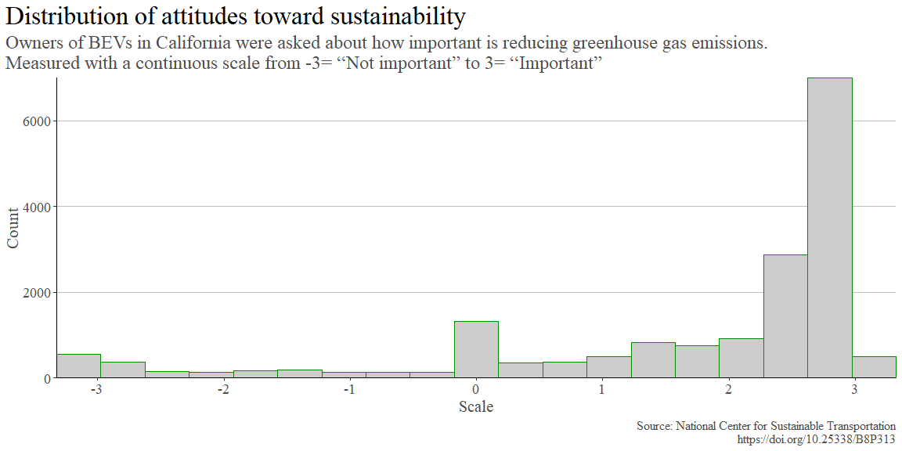
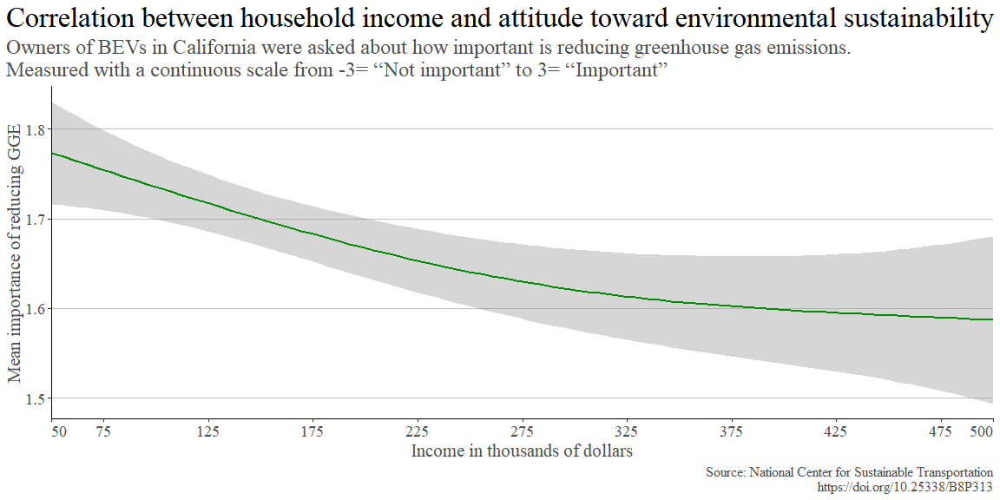
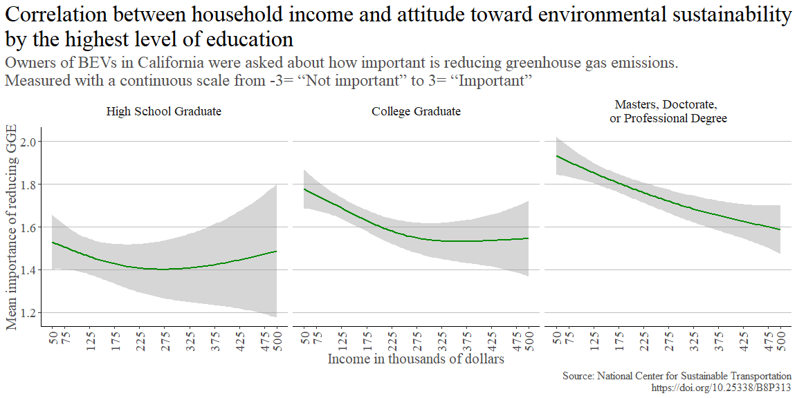

```r
# Import data

# Read xlsx
# Temporary file
temp_excel <- tempfile()
# Download using downloader package
download("https://datadryad.org/stash/downloads/file_stream/153034",
         dest = temp_excel, # Save temp file
         mode = "wb")
# Read xlxs from temp file
BEV_FCV <- read_excel(temp_excel)
```

## Background

__My question:__ Is it true that _as people get wealthier, they care and do more for the environment?_.

Here are the data sets I have found that I think will help me answer my question for this project:

+ [GDP per capita - current US dollars](https://data.worldbank.org/indicator/NY.GDP.PCAP.CD) from The World Bank.
    + This data set contains the GDP per capita in current US dollars for almost all countries with data from 1960 to 2021. According to Investopedia GDP per capita _"measures the economic output of a nation per person. It seeks to determine the prosperity of a nation by economic growth per person in that nation. Per capita income measures the amount of money earned per person in a nation."_
    + GDP per capita will be the socioeconomic metric.
+ [CO2 emissions (metric tons per capita)](https://data.worldbank.org/indicator/EN.ATM.CO2E.PC) from The World Bank.
    + This data set contains the CO2 emissions (metric tons per capita) for almost all countries with data from 1990 to 2019. The World Bank says: _"Carbon dioxide emissions are those stemming from the burning of fossil fuels and the manufacture of cement. They include carbon dioxide produced during consumption of solid, liquid, and gas fuels and gas flaring."_
    + CO2 emissions (metric tons per capita) will be our environmental metric.
+ [Encuestas de movilidad 2019](https://www.simur.gov.co/encuestas-de-movilidad) from Secretaría Distrital de Movilidad (SDM) of Bogota City Hall. (Bogota is the capital of Colombia)
    + This data set has information about travels, people, households, vehicles, etc. It's from a survey conducted by request of the Bogota City Hall to _"characterizes the mobility of the population equal to or greater than 5 years of age residing in the urban area of Bogotá and 18 neighboring municipalities in its area of influence: Bojacá, Cajicá, Chía, Cota, El Rosal, Facatativá, Funza, Gachancipá, La Calera, Madrid, Mosquera, Sibaté, Soacha, Sopó, Tabio, Tenjo, Tocancipá and Zipaquirá."_
    + This data set has the socioeconomic strata (to know the affluence) and types of vehicle (to see if there are EVs).
+ [Sociodemographic data for battery electric vehicle owning households in California (From NCST Project "Understanding the Early Adopters of Fuel Cell Vehicles")](https://datadryad.org/stash/dataset/doi:10.25338/B8P313) from Scott Hardman of the University of California and published in DRYAD.
    + This data set contains _"Sociodemographic data for fuel cell and battery electric vehicle owning households in California."_
    + This data set is from owners of BEVs and FCVs in California, it has their estimated income and a score measuring their perception of the importance of reducing greenhouse gas emissions.
+ [Number of passenger cars per adult in households, by household income. 2018-2019](https://www.ssb.no/en/transport-og-reiseliv/artikler-og-publikasjoner/the-wealthiest-bought-4-out-of-10-evs?tabell=417112) from the article by Statistics Norway called _"The wealthiest bought 4 out of 10 EVs"_.
    + This data set contains data from 2018 and 2019 about the number of passenger cars per adult in households by household income, it has data on fossil cars and electric cars.
    + This data set is already aggregated, therefore, there's not much to explore but it seems it can help solidify my answer.

## Owners of BEVs in California

This data set contains [Sociodemographic data for battery electric vehicle owning households in California (From NCST Project "Understanding the Early Adopters of Fuel Cell Vehicles")](https://doi.org/10.25338/B8P313). We are only going to focus on the: Information on vehicle owned, Household Income, Highest Level of Education, Age, Gender, Number of vehicles in the household, and a scale of the importance of reducing Greenhouse Gas Emissions (GGE). It contains around 906  Fuel-Cell Vehicles (FCV) respondents, but we are going to ignore them and focus on the results from Battery Electric Vehicle (BEV) respondents. We assume that those that own a BEV are _"environmentally friendly"_, and we are going to see if their wealth affects that perspective.

### Data Wrangling

Here's the data set we have cleaned and prepared for our analysis:


```r
# Clean & wrangle data

BEV <- BEV_FCV %>%
  filter(!is.na(`submitdate. Date submitted`)) %>%
  rename(Household_Income = `Household Income`,
         ID = `id. Response ID`,
         importance_reduce_GGE = `Importance of reducing greenhouse gas emissions (-3 not important, 3 important)`,
         edu_level = `Highest Level of Education`,
         number_vehicles_H = `Number of vehicles in the household`,
         gender = `Gender (Male 1)`) %>%
  mutate(Household_Income_Thousands = Household_Income / 1000,
         edu_level = str_replace_all(as.character(edu_level), c("1" = "Some High School", "2" = "High School Graduate", "3" = "College Graduate", "4" = "Masters, Doctorate, \nor Professional Degree")),
         gender = str_replace_all(as.character(gender), c("1" = "Male", "0" = "Female"))) %>%
  select(ID, Carmain, Household_Income_Thousands, importance_reduce_GGE, edu_level, number_vehicles_H, gender, Age) %>%
  filter(grepl('PHASE', ID))

# Turn Household income in thousands, gender and edu_level to factors
BEV$Household_Income_Thousands <- as.factor(BEV$Household_Income_Thousands)
BEV$gender <- as.factor(BEV$gender)
BEV$edu_level <- as.factor(BEV$edu_level)
# Custom order for the edu_level factor
BEV$edu_level <- factor(BEV$edu_level, levels = c("Some High School", "High School Graduate", "College Graduate", "Masters, Doctorate, \nor Professional Degree"))
BEV
```

```
## # A tibble: 19,357 × 8
##    ID         Carmain               House…¹ impor…² edu_l…³ numbe…⁴ gender   Age
##    <chr>      <chr>                 <fct>     <dbl> <fct>     <dbl> <fct>  <dbl>
##  1 PHASE_1_54 2012 Nissan Leaf      500        2.63 "Maste…       3 Female    65
##  2 PHASE_1_48 2013 Toyota Prius Pl… <NA>       2.76 "Maste…       2 Male      65
##  3 PHASE_1_49 2013 Honda Fit EV     125       -2.97 "Colle…       3 Female    55
##  4 PHASE_1_52 2013 Toyota Prius Pl… <NA>      NA     <NA>         1 <NA>      NA
##  5 PHASE_1_57 2013 Nissan Leaf      325        2.87 "Maste…       5 Female    75
##  6 PHASE_1_58 2015 Ford Fusion Ene… 275        1.9  "Maste…       3 Female    45
##  7 PHASE_1_59 2014 Chevrolet Spark… 225        1.58 "Maste…       2 Female    55
##  8 PHASE_1_62 2013 Nissan Leaf      375        2.57 "Colle…       2 Female    45
##  9 PHASE_1_63 2014 Tesla Model S    225        2.33 "High …       2 Female    35
## 10 PHASE_1_64 2013 Tesla Model S    275        2.64 "Maste…       3 Female    75
## # … with 19,347 more rows, and abbreviated variable names
## #   ¹​Household_Income_Thousands, ²​importance_reduce_GGE, ³​edu_level,
## #   ⁴​number_vehicles_H
```
### Summary Statistics


```r
# Get Summary Statistics
BEV %>% st()
```

<table class="table" style="margin-left: auto; margin-right: auto;">
<caption>Summary Statistics</caption>
 <thead>
  <tr>
   <th style="text-align:left;"> Variable </th>
   <th style="text-align:left;"> N </th>
   <th style="text-align:left;"> Mean </th>
   <th style="text-align:left;"> Std. Dev. </th>
   <th style="text-align:left;"> Min </th>
   <th style="text-align:left;"> Pctl. 25 </th>
   <th style="text-align:left;"> Pctl. 75 </th>
   <th style="text-align:left;"> Max </th>
  </tr>
 </thead>
<tbody>
  <tr>
   <td style="text-align:left;"> Household_Income_Thousands </td>
   <td style="text-align:left;"> 16175 </td>
   <td style="text-align:left;">  </td>
   <td style="text-align:left;">  </td>
   <td style="text-align:left;">  </td>
   <td style="text-align:left;">  </td>
   <td style="text-align:left;">  </td>
   <td style="text-align:left;">  </td>
  </tr>
  <tr>
   <td style="text-align:left;"> ... 50 </td>
   <td style="text-align:left;"> 585 </td>
   <td style="text-align:left;"> 4% </td>
   <td style="text-align:left;">  </td>
   <td style="text-align:left;">  </td>
   <td style="text-align:left;">  </td>
   <td style="text-align:left;">  </td>
   <td style="text-align:left;">  </td>
  </tr>
  <tr>
   <td style="text-align:left;"> ... 75 </td>
   <td style="text-align:left;"> 2395 </td>
   <td style="text-align:left;"> 15% </td>
   <td style="text-align:left;">  </td>
   <td style="text-align:left;">  </td>
   <td style="text-align:left;">  </td>
   <td style="text-align:left;">  </td>
   <td style="text-align:left;">  </td>
  </tr>
  <tr>
   <td style="text-align:left;"> ... 125 </td>
   <td style="text-align:left;"> 3902 </td>
   <td style="text-align:left;"> 24% </td>
   <td style="text-align:left;">  </td>
   <td style="text-align:left;">  </td>
   <td style="text-align:left;">  </td>
   <td style="text-align:left;">  </td>
   <td style="text-align:left;">  </td>
  </tr>
  <tr>
   <td style="text-align:left;"> ... 175 </td>
   <td style="text-align:left;"> 3366 </td>
   <td style="text-align:left;"> 21% </td>
   <td style="text-align:left;">  </td>
   <td style="text-align:left;">  </td>
   <td style="text-align:left;">  </td>
   <td style="text-align:left;">  </td>
   <td style="text-align:left;">  </td>
  </tr>
  <tr>
   <td style="text-align:left;"> ... 225 </td>
   <td style="text-align:left;"> 2260 </td>
   <td style="text-align:left;"> 14% </td>
   <td style="text-align:left;">  </td>
   <td style="text-align:left;">  </td>
   <td style="text-align:left;">  </td>
   <td style="text-align:left;">  </td>
   <td style="text-align:left;">  </td>
  </tr>
  <tr>
   <td style="text-align:left;"> ... 275 </td>
   <td style="text-align:left;"> 1432 </td>
   <td style="text-align:left;"> 9% </td>
   <td style="text-align:left;">  </td>
   <td style="text-align:left;">  </td>
   <td style="text-align:left;">  </td>
   <td style="text-align:left;">  </td>
   <td style="text-align:left;">  </td>
  </tr>
  <tr>
   <td style="text-align:left;"> ... 325 </td>
   <td style="text-align:left;"> 747 </td>
   <td style="text-align:left;"> 5% </td>
   <td style="text-align:left;">  </td>
   <td style="text-align:left;">  </td>
   <td style="text-align:left;">  </td>
   <td style="text-align:left;">  </td>
   <td style="text-align:left;">  </td>
  </tr>
  <tr>
   <td style="text-align:left;"> ... 375 </td>
   <td style="text-align:left;"> 374 </td>
   <td style="text-align:left;"> 2% </td>
   <td style="text-align:left;">  </td>
   <td style="text-align:left;">  </td>
   <td style="text-align:left;">  </td>
   <td style="text-align:left;">  </td>
   <td style="text-align:left;">  </td>
  </tr>
  <tr>
   <td style="text-align:left;"> ... 425 </td>
   <td style="text-align:left;"> 265 </td>
   <td style="text-align:left;"> 2% </td>
   <td style="text-align:left;">  </td>
   <td style="text-align:left;">  </td>
   <td style="text-align:left;">  </td>
   <td style="text-align:left;">  </td>
   <td style="text-align:left;">  </td>
  </tr>
  <tr>
   <td style="text-align:left;"> ... 475 </td>
   <td style="text-align:left;"> 179 </td>
   <td style="text-align:left;"> 1% </td>
   <td style="text-align:left;">  </td>
   <td style="text-align:left;">  </td>
   <td style="text-align:left;">  </td>
   <td style="text-align:left;">  </td>
   <td style="text-align:left;">  </td>
  </tr>
  <tr>
   <td style="text-align:left;"> ... 500 </td>
   <td style="text-align:left;"> 670 </td>
   <td style="text-align:left;"> 4% </td>
   <td style="text-align:left;">  </td>
   <td style="text-align:left;">  </td>
   <td style="text-align:left;">  </td>
   <td style="text-align:left;">  </td>
   <td style="text-align:left;">  </td>
  </tr>
  <tr>
   <td style="text-align:left;"> importance_reduce_GGE </td>
   <td style="text-align:left;"> 17376 </td>
   <td style="text-align:left;"> 1.7 </td>
   <td style="text-align:left;"> 1.6 </td>
   <td style="text-align:left;"> -3 </td>
   <td style="text-align:left;"> 1.1 </td>
   <td style="text-align:left;"> 2.8 </td>
   <td style="text-align:left;"> 3 </td>
  </tr>
  <tr>
   <td style="text-align:left;"> edu_level </td>
   <td style="text-align:left;"> 18117 </td>
   <td style="text-align:left;">  </td>
   <td style="text-align:left;">  </td>
   <td style="text-align:left;">  </td>
   <td style="text-align:left;">  </td>
   <td style="text-align:left;">  </td>
   <td style="text-align:left;">  </td>
  </tr>
  <tr>
   <td style="text-align:left;"> ... Some High School </td>
   <td style="text-align:left;"> 43 </td>
   <td style="text-align:left;"> 0% </td>
   <td style="text-align:left;">  </td>
   <td style="text-align:left;">  </td>
   <td style="text-align:left;">  </td>
   <td style="text-align:left;">  </td>
   <td style="text-align:left;">  </td>
  </tr>
  <tr>
   <td style="text-align:left;"> ... High School Graduate </td>
   <td style="text-align:left;"> 2307 </td>
   <td style="text-align:left;"> 13% </td>
   <td style="text-align:left;">  </td>
   <td style="text-align:left;">  </td>
   <td style="text-align:left;">  </td>
   <td style="text-align:left;">  </td>
   <td style="text-align:left;">  </td>
  </tr>
  <tr>
   <td style="text-align:left;"> ... College Graduate </td>
   <td style="text-align:left;"> 7300 </td>
   <td style="text-align:left;"> 40% </td>
   <td style="text-align:left;">  </td>
   <td style="text-align:left;">  </td>
   <td style="text-align:left;">  </td>
   <td style="text-align:left;">  </td>
   <td style="text-align:left;">  </td>
  </tr>
  <tr>
   <td style="text-align:left;"> ... Masters, Doctorate, 
or Professional Degree </td>
   <td style="text-align:left;"> 8467 </td>
   <td style="text-align:left;"> 47% </td>
   <td style="text-align:left;">  </td>
   <td style="text-align:left;">  </td>
   <td style="text-align:left;">  </td>
   <td style="text-align:left;">  </td>
   <td style="text-align:left;">  </td>
  </tr>
  <tr>
   <td style="text-align:left;"> number_vehicles_H </td>
   <td style="text-align:left;"> 19357 </td>
   <td style="text-align:left;"> 2.3 </td>
   <td style="text-align:left;"> 0.97 </td>
   <td style="text-align:left;"> 1 </td>
   <td style="text-align:left;"> 2 </td>
   <td style="text-align:left;"> 3 </td>
   <td style="text-align:left;"> 5 </td>
  </tr>
  <tr>
   <td style="text-align:left;"> gender </td>
   <td style="text-align:left;"> 18029 </td>
   <td style="text-align:left;">  </td>
   <td style="text-align:left;">  </td>
   <td style="text-align:left;">  </td>
   <td style="text-align:left;">  </td>
   <td style="text-align:left;">  </td>
   <td style="text-align:left;">  </td>
  </tr>
  <tr>
   <td style="text-align:left;"> ... Female </td>
   <td style="text-align:left;"> 13309 </td>
   <td style="text-align:left;"> 74% </td>
   <td style="text-align:left;">  </td>
   <td style="text-align:left;">  </td>
   <td style="text-align:left;">  </td>
   <td style="text-align:left;">  </td>
   <td style="text-align:left;">  </td>
  </tr>
  <tr>
   <td style="text-align:left;"> ... Male </td>
   <td style="text-align:left;"> 4720 </td>
   <td style="text-align:left;"> 26% </td>
   <td style="text-align:left;">  </td>
   <td style="text-align:left;">  </td>
   <td style="text-align:left;">  </td>
   <td style="text-align:left;">  </td>
   <td style="text-align:left;">  </td>
  </tr>
  <tr>
   <td style="text-align:left;"> Age </td>
   <td style="text-align:left;"> 18045 </td>
   <td style="text-align:left;"> 50 </td>
   <td style="text-align:left;"> 13 </td>
   <td style="text-align:left;"> 18 </td>
   <td style="text-align:left;"> 35 </td>
   <td style="text-align:left;"> 55 </td>
   <td style="text-align:left;"> 80 </td>
  </tr>
</tbody>
</table>

### Data Visualization and Discussion


```r
# Plot & visualize data
BEV %>% ggplot(aes(x = importance_reduce_GGE)) +
  geom_histogram(binwidth = 0.3, color = "green4", fill = "gray80") +
  theme_classic() +
  scale_x_continuous(breaks = c(-3, -2, -1, 0, 1, 2, 3),
                     expand = expansion(mult = c(0, 0))) +
  scale_y_continuous(expand = expansion(mult = c(0, 0))) +
  theme(panel.grid.major.y = element_line(color = "gray", linetype = 1),
        plot.title.position = "plot",
        plot.title = element_text(size = 25, family = "serif", color = "black"),
        plot.subtitle = element_text(size = 18, family = "serif", color = "gray30"),
        plot.caption = element_text(hjust = 1, family = "serif", color = "gray30", size = 12),
        axis.title = element_text(color = "gray30", size = 16, family = "serif"),
        axis.text.x = element_text(color = "gray30", size = 14, family = "serif"),
        axis.text.y = element_text(color = "gray30", size = 14, family = "serif")) +
  labs(title = "Distribution of attitudes toward sustainability", subtitle = "Owners of BEVs in California were asked about how important is reducing greenhouse gas emissions. \nMeasured with a continuous scale from -3= “Not important” to 3= “Important”", y = "Count", x = "Scale", caption = "Source: National Center for Sustainable Transportation\nhttps://doi.org/10.25338/B8P313")
```

<!-- -->
Going back to the summary statistics table, the mean of this scale is around `1.7`, which tells us there's an attitude of care for the sustainability of the environment from owners of BEVs in California. With the histogram, we can see the majority of the respondents consider _"Important"_ to a certain extent reducing greenhouse gas emissions.

Now, let's focus on the wealth of the owners of BEVs in California. According to the summary statistics, we have the majority of the respondents with an income between _$75k_ and _$225k_, but we have enough data for incomes greater than _$225k_ to see if on average people with higher income care more about the environment than those with lower incomes among those that we consider _"environmentally friendly"_ due to owning a BEV.


```r
# Plot & visualize data

# Turn Household income in thousands factor to a numeric data type
BEV$Household_Income_Thousands <- as.numeric(as.character(BEV$Household_Income_Thousands))

BEV %>%
  filter(!is.na(Household_Income_Thousands)) %>%
  filter(!is.na(edu_level)) %>%
  ggplot(aes(y = importance_reduce_GGE, x = Household_Income_Thousands)) +
  geom_smooth(color = "green4") +
  theme_classic() +
  #coord_cartesian(ylim = c(-3, 3), xlim = c(50, 500))
  scale_x_continuous(breaks = c(50, 75, 125, 175, 225, 275, 325, 375, 425, 475, 500),
                     expand = expansion(mult = c(0, 0))) +
  theme(panel.grid.major.y = element_line(color = "gray", linetype = 1),
        plot.title.position = "plot",
        plot.title = element_text(size = 25, family = "serif", color = "black"),
        plot.subtitle = element_text(size = 18, family = "serif", color = "gray30"),
        plot.caption = element_text(hjust = 1, family = "serif", color = "gray30", size = 12),
        axis.title = element_text(color = "gray30", size = 16, family = "serif"),
        axis.text.x = element_text(color = "gray30", size = 14, family = "serif", hjust = c(0, 0.5, 0.5, 0.5, 0.5, 0.5, 0.5, 0.5, 0.5, 0.5, 1)),
        axis.text.y = element_text(color = "gray30", size = 14, family = "serif")) +
  labs(title = "Correlation between household income and attitude toward environmental sustainability", subtitle = "Owners of BEVs in California were asked about how important is reducing greenhouse gas emissions. \nMeasured with a continuous scale from -3= “Not important” to 3= “Important”", y = "Mean importance of reducing GGE", x = "Income in thousands of dollars", caption = "Source: National Center for Sustainable Transportation\nhttps://doi.org/10.25338/B8P313")
```

<!-- -->
Although the mean is between `1.5` and `1.8`, which leans towards the _“Important”_ attitude, we see that, on average, more affluent owners of BEVs in California consider it less important than those with lower incomes.


```r
# Plot & visualize data
BEV %>%
  filter(!is.na(Household_Income_Thousands)) %>%
  filter(!is.na(edu_level)) %>%
  # Remove "Some High School" observations because they were too small N=43 to be significant
  filter(edu_level != "Some High School") %>%
  ggplot(aes(y = importance_reduce_GGE, x = Household_Income_Thousands)) +
  geom_smooth(color = "green4") +
  facet_wrap(~edu_level, nrow = 1) +
  theme_classic() +
  scale_x_continuous(breaks = c(50, 75, 125, 175, 225, 275, 325, 375, 425, 475, 500)) +
  theme(panel.grid.major.y = element_line(color = "gray", linetype = 1),
        plot.title.position = "plot",
        plot.title = element_text(size = 25, family = "serif", color = "black"),
        plot.subtitle = element_text(size = 18, family = "serif", color = "gray30"),
        plot.caption = element_text(hjust = 1, family = "serif", color = "gray30", size = 12),
        axis.title = element_text(color = "gray30", size = 16, family = "serif"),
        axis.text.x = element_text(color = "gray30", size = 14, family = "serif", angle = 90, hjust = 1, vjust = 0.5),
        axis.text.y = element_text(color = "gray30", size = 14, family = "serif"),
        strip.text.x = element_text(color = "gray10", size = 14, family = "serif"),
        strip.background = element_rect(color = "white", fill = "white")) +
  labs(title = "Correlation between household income and attitude toward environmental sustainability\nby the highest level of education", subtitle = "Owners of BEVs in California were asked about how important is reducing greenhouse gas emissions. \nMeasured with a continuous scale from -3= “Not important” to 3= “Important”", y = "Mean importance of reducing GGE", x = "Income in thousands of dollars", caption = "Source: National Center for Sustainable Transportation\nhttps://doi.org/10.25338/B8P313")
```

<!-- -->
First, it's relevant to say that _"Some High School"_ observations were removed because they were too small __N=43__ to be accurate or significant for this analysis.

We can recognize several patterns from the correlation between household income and the attitude towards environmental sustainability segmented by the highest educational level for the owners of BEVs in California. We can see that people with a higher level of education have, on average, a higher "Important" score for the perception of reducing greenhouse gas emissions than those with a lower education level. Also, we discover that more affluent people consider it less important than those with lower incomes when segmented by education level; However, we cannot be sure for the _High School Graduates_ group because the confidence interval is too large at the highest incomes. One of the reasons we might have this wide confidence interval for the perception of reducing GGE of the _High School Graduate_ group with the highest incomes is that we do not have enough observations for this group with these incomes.

An important question to move forward in the analysis is why even the highly educated and wealthier owners of BEVs in California seem to care less about GGE than those at the same educational level but with less affluence, is there something they know that less affluent people in their educational level group don't know about reducing GGE, or is it something that has to do with the psyche of the wealthiest?

Since this wasn't a longitudinal study, we cannot conclude that as people get richer they care more or less about the environment, but we do see that owners of BEVs in California with higher incomes (that are doing something good for the environment by using battery electric vehicles instead of fuel-based ones) on average care about reducing GGE, but they care less than less affluent owners.

It's important to note that a limitation of this data set is that we don't have information about the attitude of owners of non-BEVs, like owners of fuel-based vehicles, to compare if there are differences in their perspectives and their incomes.

### Conclusion

+ Among those in California that are doing something good for the environment by using battery electric vehicles instead of fuel-based ones, on average care about reducing GGE, but the more affluent care less than less affluent owners.
+ When distinguished by the highest level of education, we find the more educated owners of BEVs in California consider more important reducing GGE than less educated owners.
+ When looking at the correlation between the household income in thousands and the mean importance of reducing GGE of BEV owners in California grouped by educational level, the wealthier and more educated care a little bit less than the less affluent.


```r
# Plot & visualize data
```
