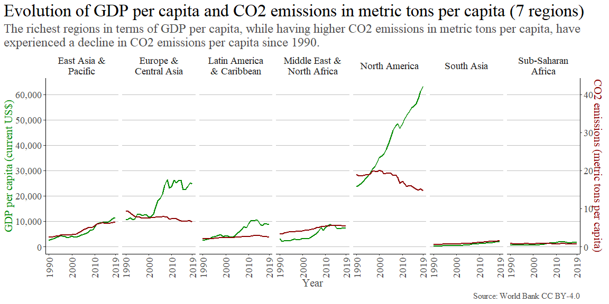
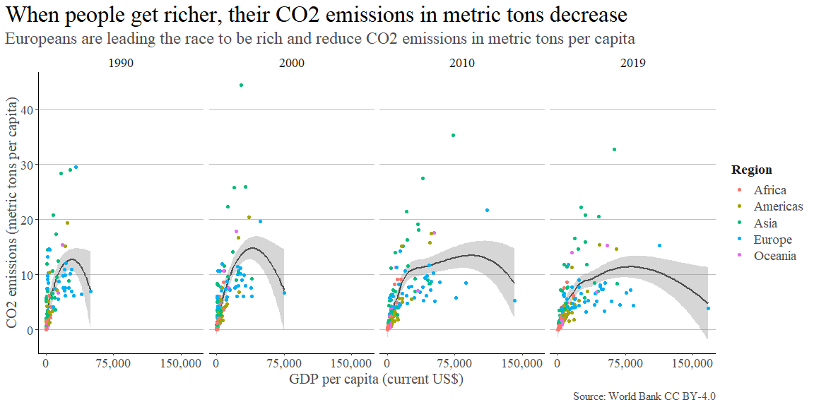

```r
# Import data

############# Survey of owners of BEVs in California #############
# Read xlsx
# Temporary file
temp_excel <- tempfile()
# Download using downloader package
download("https://datadryad.org/stash/downloads/file_stream/153034",
         dest = temp_excel, # Save temp file
         mode = "wb")
# Read xlxs from temp file
BEV_FCV <- read_excel(temp_excel)

############# GDP per capita (current US$) #############
# Download zip using downloader package
# Temporary file
temp_zip <- tempfile()
# Temporary directory
temp_dir <- tempdir()
# Download using downloader library
download("https://api.worldbank.org/v2/en/indicator/NY.GDP.PCAP.CD?downloadformat=csv",
         destfile = temp_zip, # Save temp file
         mode = "wb")
# Unzip temporary file in temporary directory
unzip(temp_zip, exdir = temp_dir)

# Read csv file using foreign package
GDP <- read_csv(paste(temp_dir, "API_NY.GDP.PCAP.CD_DS2_en_csv_v2_5358417.csv", sep = "/"), skip = 3)

############# CO2 emissions (metric tons per capita) #############
# Download zip using downloader package
# Temporary file
temp_zip <- tempfile()
# Temporary directory
temp_dir <- tempdir()
# Download using downloader library
download("https://api.worldbank.org/v2/en/indicator/EN.ATM.CO2E.PC?downloadformat=csv",
         destfile = temp_zip, # Save temp file
         mode = "wb")
# Unzip temporary file in temporary directory
unzip(temp_zip, exdir = temp_dir)

# Read csv file using foreign package
CO2_emissions <- read_csv(paste(temp_dir, "API_EN.ATM.CO2E.PC_DS2_en_csv_v2_5358914.csv", sep = "/"), skip = 3)

############# ISO 3166 Countries with Regional Codes #############

# Read csv of the ISO 3166 Countries with Regional Codes (taken from Luke Duncalfe's GitHub reop)
countries_ISO3166 <- read.csv("https://github.com/lukes/ISO-3166-Countries-with-Regional-Codes/blob/master/all/all.csv?raw=true")
```

## Executive Summary

In this project, we tried to discover if people _CARE_ more about the environment and _DO_ something more for sustainability as they get richer. To gauge whether they _CARE_, we explored data from a survey of thousands of battery electric vehicle (BEV) owners in the US state of California. They are already helping the environment by owning an electric vehicle but we found that BEV owners with higher incomes care about reducing greenhouse gas emissions, but they care less than lower-income BEV owners. To assess whether people _DO_ something for environmental sustainability as they got richer, we explored the relationship between _GDP per capita_ and _CO2 emissions (metric tons per capita)_ over the years with data available from every country in the world.

## CARE: Owners of BEVs in California

This data set contains [Sociodemographic data for battery electric vehicle owning households in California (From NCST Project "Understanding the Early Adopters of Fuel Cell Vehicles")](https://doi.org/10.25338/B8P313). We are only going to focus on the: _Information on vehicle owned_, _Household Income_, _Highest Level of Education_, _Age_, _Gender_, _Number of vehicles in the household_, and a scale of the _importance of reducing Greenhouse Gas Emissions (GGE)_. It contains around 906 Fuel-Cell Vehicles (FCV) respondents data, but we ignore them to focus on the results from Battery Electric Vehicle (BEV) respondents. We assumed that those that own a BEV are _"environmentally friendly"_, and we are going to see if their wealth affects their perception of care for the environment.

### Data Wrangling

Here's the data set we have cleaned and prepared for our analysis:


```r
# Clean & wrangle data

BEV <- BEV_FCV %>%
  filter(!is.na(`submitdate. Date submitted`)) %>%
  rename(Household_Income = `Household Income`,
         ID = `id. Response ID`,
         importance_reduce_GGE = `Importance of reducing greenhouse gas emissions (-3 not important, 3 important)`,
         edu_level = `Highest Level of Education`,
         number_vehicles_H = `Number of vehicles in the household`,
         gender = `Gender (Male 1)`) %>%
  mutate(Household_Income_Thousands = Household_Income / 1000,
         edu_level = str_replace_all(as.character(edu_level), c("1" = "Some High School", "2" = "High School Graduate", "3" = "College Graduate", "4" = "Masters, Doctorate, \nor Professional Degree")),
         gender = str_replace_all(as.character(gender), c("1" = "Male", "0" = "Female"))) %>%
  select(ID, Carmain, Household_Income_Thousands, importance_reduce_GGE, edu_level, number_vehicles_H, gender, Age) %>%
  filter(grepl('PHASE', ID))

# Turn Household income in thousands, gender and edu_level to factors
BEV$Household_Income_Thousands <- as.factor(BEV$Household_Income_Thousands)
BEV$gender <- as.factor(BEV$gender)
BEV$edu_level <- as.factor(BEV$edu_level)
# Custom order for the edu_level factor
BEV$edu_level <- factor(BEV$edu_level, levels = c("Some High School", "High School Graduate", "College Graduate", "Masters, Doctorate, \nor Professional Degree"))
BEV
```

```
## # A tibble: 19,357 × 8
##    ID         Carmain               House…¹ impor…² edu_l…³ numbe…⁴ gender   Age
##    <chr>      <chr>                 <fct>     <dbl> <fct>     <dbl> <fct>  <dbl>
##  1 PHASE_1_54 2012 Nissan Leaf      500        2.63 "Maste…       3 Female    65
##  2 PHASE_1_48 2013 Toyota Prius Pl… <NA>       2.76 "Maste…       2 Male      65
##  3 PHASE_1_49 2013 Honda Fit EV     125       -2.97 "Colle…       3 Female    55
##  4 PHASE_1_52 2013 Toyota Prius Pl… <NA>      NA     <NA>         1 <NA>      NA
##  5 PHASE_1_57 2013 Nissan Leaf      325        2.87 "Maste…       5 Female    75
##  6 PHASE_1_58 2015 Ford Fusion Ene… 275        1.9  "Maste…       3 Female    45
##  7 PHASE_1_59 2014 Chevrolet Spark… 225        1.58 "Maste…       2 Female    55
##  8 PHASE_1_62 2013 Nissan Leaf      375        2.57 "Colle…       2 Female    45
##  9 PHASE_1_63 2014 Tesla Model S    225        2.33 "High …       2 Female    35
## 10 PHASE_1_64 2013 Tesla Model S    275        2.64 "Maste…       3 Female    75
## # … with 19,347 more rows, and abbreviated variable names
## #   ¹​Household_Income_Thousands, ²​importance_reduce_GGE, ³​edu_level,
## #   ⁴​number_vehicles_H
```
### Summary Statistics


```r
# Get Summary Statistics
BEV %>% st(title = "Owners of BEVs - socioeconomic variables and data on attitudes towards sustainability")
```

<table class="table" style="margin-left: auto; margin-right: auto;">
<caption>Owners of BEVs - socioeconomic variables and data on attitudes towards sustainability</caption>
 <thead>
  <tr>
   <th style="text-align:left;"> Variable </th>
   <th style="text-align:left;"> N </th>
   <th style="text-align:left;"> Mean </th>
   <th style="text-align:left;"> Std. Dev. </th>
   <th style="text-align:left;"> Min </th>
   <th style="text-align:left;"> Pctl. 25 </th>
   <th style="text-align:left;"> Pctl. 75 </th>
   <th style="text-align:left;"> Max </th>
  </tr>
 </thead>
<tbody>
  <tr>
   <td style="text-align:left;"> Household_Income_Thousands </td>
   <td style="text-align:left;"> 16175 </td>
   <td style="text-align:left;">  </td>
   <td style="text-align:left;">  </td>
   <td style="text-align:left;">  </td>
   <td style="text-align:left;">  </td>
   <td style="text-align:left;">  </td>
   <td style="text-align:left;">  </td>
  </tr>
  <tr>
   <td style="text-align:left;"> ... 50 </td>
   <td style="text-align:left;"> 585 </td>
   <td style="text-align:left;"> 4% </td>
   <td style="text-align:left;">  </td>
   <td style="text-align:left;">  </td>
   <td style="text-align:left;">  </td>
   <td style="text-align:left;">  </td>
   <td style="text-align:left;">  </td>
  </tr>
  <tr>
   <td style="text-align:left;"> ... 75 </td>
   <td style="text-align:left;"> 2395 </td>
   <td style="text-align:left;"> 15% </td>
   <td style="text-align:left;">  </td>
   <td style="text-align:left;">  </td>
   <td style="text-align:left;">  </td>
   <td style="text-align:left;">  </td>
   <td style="text-align:left;">  </td>
  </tr>
  <tr>
   <td style="text-align:left;"> ... 125 </td>
   <td style="text-align:left;"> 3902 </td>
   <td style="text-align:left;"> 24% </td>
   <td style="text-align:left;">  </td>
   <td style="text-align:left;">  </td>
   <td style="text-align:left;">  </td>
   <td style="text-align:left;">  </td>
   <td style="text-align:left;">  </td>
  </tr>
  <tr>
   <td style="text-align:left;"> ... 175 </td>
   <td style="text-align:left;"> 3366 </td>
   <td style="text-align:left;"> 21% </td>
   <td style="text-align:left;">  </td>
   <td style="text-align:left;">  </td>
   <td style="text-align:left;">  </td>
   <td style="text-align:left;">  </td>
   <td style="text-align:left;">  </td>
  </tr>
  <tr>
   <td style="text-align:left;"> ... 225 </td>
   <td style="text-align:left;"> 2260 </td>
   <td style="text-align:left;"> 14% </td>
   <td style="text-align:left;">  </td>
   <td style="text-align:left;">  </td>
   <td style="text-align:left;">  </td>
   <td style="text-align:left;">  </td>
   <td style="text-align:left;">  </td>
  </tr>
  <tr>
   <td style="text-align:left;"> ... 275 </td>
   <td style="text-align:left;"> 1432 </td>
   <td style="text-align:left;"> 9% </td>
   <td style="text-align:left;">  </td>
   <td style="text-align:left;">  </td>
   <td style="text-align:left;">  </td>
   <td style="text-align:left;">  </td>
   <td style="text-align:left;">  </td>
  </tr>
  <tr>
   <td style="text-align:left;"> ... 325 </td>
   <td style="text-align:left;"> 747 </td>
   <td style="text-align:left;"> 5% </td>
   <td style="text-align:left;">  </td>
   <td style="text-align:left;">  </td>
   <td style="text-align:left;">  </td>
   <td style="text-align:left;">  </td>
   <td style="text-align:left;">  </td>
  </tr>
  <tr>
   <td style="text-align:left;"> ... 375 </td>
   <td style="text-align:left;"> 374 </td>
   <td style="text-align:left;"> 2% </td>
   <td style="text-align:left;">  </td>
   <td style="text-align:left;">  </td>
   <td style="text-align:left;">  </td>
   <td style="text-align:left;">  </td>
   <td style="text-align:left;">  </td>
  </tr>
  <tr>
   <td style="text-align:left;"> ... 425 </td>
   <td style="text-align:left;"> 265 </td>
   <td style="text-align:left;"> 2% </td>
   <td style="text-align:left;">  </td>
   <td style="text-align:left;">  </td>
   <td style="text-align:left;">  </td>
   <td style="text-align:left;">  </td>
   <td style="text-align:left;">  </td>
  </tr>
  <tr>
   <td style="text-align:left;"> ... 475 </td>
   <td style="text-align:left;"> 179 </td>
   <td style="text-align:left;"> 1% </td>
   <td style="text-align:left;">  </td>
   <td style="text-align:left;">  </td>
   <td style="text-align:left;">  </td>
   <td style="text-align:left;">  </td>
   <td style="text-align:left;">  </td>
  </tr>
  <tr>
   <td style="text-align:left;"> ... 500 </td>
   <td style="text-align:left;"> 670 </td>
   <td style="text-align:left;"> 4% </td>
   <td style="text-align:left;">  </td>
   <td style="text-align:left;">  </td>
   <td style="text-align:left;">  </td>
   <td style="text-align:left;">  </td>
   <td style="text-align:left;">  </td>
  </tr>
  <tr>
   <td style="text-align:left;"> importance_reduce_GGE </td>
   <td style="text-align:left;"> 17376 </td>
   <td style="text-align:left;"> 1.7 </td>
   <td style="text-align:left;"> 1.6 </td>
   <td style="text-align:left;"> -3 </td>
   <td style="text-align:left;"> 1.1 </td>
   <td style="text-align:left;"> 2.8 </td>
   <td style="text-align:left;"> 3 </td>
  </tr>
  <tr>
   <td style="text-align:left;"> edu_level </td>
   <td style="text-align:left;"> 18117 </td>
   <td style="text-align:left;">  </td>
   <td style="text-align:left;">  </td>
   <td style="text-align:left;">  </td>
   <td style="text-align:left;">  </td>
   <td style="text-align:left;">  </td>
   <td style="text-align:left;">  </td>
  </tr>
  <tr>
   <td style="text-align:left;"> ... Some High School </td>
   <td style="text-align:left;"> 43 </td>
   <td style="text-align:left;"> 0% </td>
   <td style="text-align:left;">  </td>
   <td style="text-align:left;">  </td>
   <td style="text-align:left;">  </td>
   <td style="text-align:left;">  </td>
   <td style="text-align:left;">  </td>
  </tr>
  <tr>
   <td style="text-align:left;"> ... High School Graduate </td>
   <td style="text-align:left;"> 2307 </td>
   <td style="text-align:left;"> 13% </td>
   <td style="text-align:left;">  </td>
   <td style="text-align:left;">  </td>
   <td style="text-align:left;">  </td>
   <td style="text-align:left;">  </td>
   <td style="text-align:left;">  </td>
  </tr>
  <tr>
   <td style="text-align:left;"> ... College Graduate </td>
   <td style="text-align:left;"> 7300 </td>
   <td style="text-align:left;"> 40% </td>
   <td style="text-align:left;">  </td>
   <td style="text-align:left;">  </td>
   <td style="text-align:left;">  </td>
   <td style="text-align:left;">  </td>
   <td style="text-align:left;">  </td>
  </tr>
  <tr>
   <td style="text-align:left;"> ... Masters, Doctorate, 
or Professional Degree </td>
   <td style="text-align:left;"> 8467 </td>
   <td style="text-align:left;"> 47% </td>
   <td style="text-align:left;">  </td>
   <td style="text-align:left;">  </td>
   <td style="text-align:left;">  </td>
   <td style="text-align:left;">  </td>
   <td style="text-align:left;">  </td>
  </tr>
  <tr>
   <td style="text-align:left;"> number_vehicles_H </td>
   <td style="text-align:left;"> 19357 </td>
   <td style="text-align:left;"> 2.3 </td>
   <td style="text-align:left;"> 0.97 </td>
   <td style="text-align:left;"> 1 </td>
   <td style="text-align:left;"> 2 </td>
   <td style="text-align:left;"> 3 </td>
   <td style="text-align:left;"> 5 </td>
  </tr>
  <tr>
   <td style="text-align:left;"> gender </td>
   <td style="text-align:left;"> 18029 </td>
   <td style="text-align:left;">  </td>
   <td style="text-align:left;">  </td>
   <td style="text-align:left;">  </td>
   <td style="text-align:left;">  </td>
   <td style="text-align:left;">  </td>
   <td style="text-align:left;">  </td>
  </tr>
  <tr>
   <td style="text-align:left;"> ... Female </td>
   <td style="text-align:left;"> 13309 </td>
   <td style="text-align:left;"> 74% </td>
   <td style="text-align:left;">  </td>
   <td style="text-align:left;">  </td>
   <td style="text-align:left;">  </td>
   <td style="text-align:left;">  </td>
   <td style="text-align:left;">  </td>
  </tr>
  <tr>
   <td style="text-align:left;"> ... Male </td>
   <td style="text-align:left;"> 4720 </td>
   <td style="text-align:left;"> 26% </td>
   <td style="text-align:left;">  </td>
   <td style="text-align:left;">  </td>
   <td style="text-align:left;">  </td>
   <td style="text-align:left;">  </td>
   <td style="text-align:left;">  </td>
  </tr>
  <tr>
   <td style="text-align:left;"> Age </td>
   <td style="text-align:left;"> 18045 </td>
   <td style="text-align:left;"> 50 </td>
   <td style="text-align:left;"> 13 </td>
   <td style="text-align:left;"> 18 </td>
   <td style="text-align:left;"> 35 </td>
   <td style="text-align:left;"> 55 </td>
   <td style="text-align:left;"> 80 </td>
  </tr>
</tbody>
</table>

### Data Visualization and Discussion


```r
# Plot & visualize data
BEV %>% ggplot(aes(x = importance_reduce_GGE)) +
  geom_histogram(binwidth = 0.35, color = "green4", fill = "gray80") +
  theme_classic() +
  scale_x_continuous(breaks = c(-3, -2, -1, 0, 1, 2, 3),
                     expand = expansion(mult = c(0, 0))) +
  scale_y_continuous(expand = expansion(mult = c(0, 0))) +
  theme(panel.grid.major.y = element_line(color = "gray", linetype = 1),
        plot.title.position = "plot",
        plot.title = element_text(size = 25, family = "serif", color = "black"),
        plot.subtitle = element_text(size = 18, family = "serif", color = "gray30"),
        plot.caption = element_text(hjust = 1, family = "serif", color = "gray30", size = 12),
        axis.title = element_text(color = "gray30", size = 16, family = "serif"),
        axis.text.x = element_text(color = "gray30", size = 14, family = "serif"),
        axis.text.y = element_text(color = "gray30", size = 14, family = "serif")) +
  labs(title = "Distribution of attitudes toward sustainability", subtitle = "Owners of BEVs in California were asked about how important is reducing greenhouse gas emissions. \nMeasured with a continuous scale from -3= “Not important” to 3= “Important”", y = "Count", x = "Scale", caption = "Source: National Center for Sustainable Transportation\nhttps://doi.org/10.25338/B8P313")
```

<!-- -->
Going back to the summary statistics table, the mean of this scale is around `1.7`, which tells us there's an attitude of care for the sustainability of the environment from owners of BEVs in California. With the histogram, we can see the majority of the respondents consider _"Important"_ to a certain extent reducing greenhouse gas emissions.

According to the summary statistics, in terms of wealth, the majority of owners of BEVs in California have an income between _$75k_ and _$225k_, but we have enough data for incomes greater than _$225k_ to see if on average people with higher income care more about the environment than those with lower incomes among those that we consider _"environmentally friendly"_ due to owning a BEV.


```r
# Plot & visualize data

# Turn Household income in thousands factor to a numeric data type
BEV$Household_Income_Thousands <- as.numeric(as.character(BEV$Household_Income_Thousands))

BEV %>%
  filter(!is.na(Household_Income_Thousands)) %>%
  filter(!is.na(edu_level)) %>%
  ggplot(aes(y = importance_reduce_GGE, x = Household_Income_Thousands)) +
  geom_smooth(color = "green4") +
  theme_classic() +
  #coord_cartesian(ylim = c(-3, 3), xlim = c(50, 500))
  scale_x_continuous(breaks = c(50, 75, 125, 175, 225, 275, 325, 375, 425, 475, 500),
                     expand = expansion(mult = c(0, 0))) +
  theme(panel.grid.major.y = element_line(color = "gray", linetype = 1),
        plot.title.position = "plot",
        plot.title = element_text(size = 25, family = "serif", color = "black"),
        plot.subtitle = element_text(size = 18, family = "serif", color = "gray30"),
        plot.caption = element_text(hjust = 1, family = "serif", color = "gray30", size = 12),
        axis.title = element_text(color = "gray30", size = 16, family = "serif"),
        axis.text.x = element_text(color = "gray30", size = 14, family = "serif", hjust = c(0, 0.5, 0.5, 0.5, 0.5, 0.5, 0.5, 0.5, 0.5, 0.5, 1)),
        axis.text.y = element_text(color = "gray30", size = 14, family = "serif")) +
  labs(title = "Correlation between household income and attitude toward environmental sustainability", subtitle = "Owners of BEVs in California were asked about how important is reducing greenhouse gas emissions. \nMeasured with a continuous scale from -3= “Not important” to 3= “Important”", y = "Mean importance of reducing GGE", x = "Income in thousands of dollars", caption = "Source: National Center for Sustainable Transportation\nhttps://doi.org/10.25338/B8P313")
```

<!-- -->
Although the mean is between `1.5` and `1.8`, which leans towards the _“Important”_ attitude, we see that, on average, more affluent owners of BEVs in California consider it less important than those with lower incomes.


```r
# Plot & visualize data
BEV %>%
  filter(!is.na(Household_Income_Thousands)) %>%
  filter(!is.na(edu_level)) %>%
  # Remove "Some High School" observations because they were too small N=43 to be significant
  filter(edu_level != "Some High School") %>%
  ggplot(aes(y = importance_reduce_GGE, x = Household_Income_Thousands)) +
  geom_smooth(color = "green4") +
  facet_wrap(~edu_level, nrow = 1) +
  theme_classic() +
  scale_x_continuous(breaks = c(50, 75, 125, 175, 225, 275, 325, 375, 425, 475, 500)) +
  theme(panel.grid.major.y = element_line(color = "gray", linetype = 1),
        plot.title.position = "plot",
        plot.title = element_text(size = 25, family = "serif", color = "black"),
        plot.subtitle = element_text(size = 18, family = "serif", color = "gray30"),
        plot.caption = element_text(hjust = 1, family = "serif", color = "gray30", size = 12),
        axis.title = element_text(color = "gray30", size = 16, family = "serif"),
        axis.text.x = element_text(color = "gray30", size = 14, family = "serif", angle = 90, hjust = 1, vjust = 0.5),
        axis.text.y = element_text(color = "gray30", size = 14, family = "serif"),
        strip.text.x = element_text(color = "gray10", size = 14, family = "serif"),
        strip.background = element_rect(color = "white", fill = "white")) +
  labs(title = "Correlation between household income and attitude toward environmental sustainability\nby the highest level of education", subtitle = "Owners of BEVs in California were asked about how important is reducing greenhouse gas emissions. \nMeasured with a continuous scale from -3= “Not important” to 3= “Important”", y = "Mean importance of reducing GGE", x = "Income in thousands of dollars", caption = "Source: National Center for Sustainable Transportation\nhttps://doi.org/10.25338/B8P313")
```

<!-- -->
First, it's relevant to say that _"Some High School"_ observations were removed because they were too small `N = 43` to be significant for the analysis.

We recognized several patterns from the correlation between household income and the attitude towards environmental sustainability segmented by the highest educational level for the owners of BEVs in California. We can see that people with a higher level of education have, on average, a higher _"Important"_ score for the perception of reducing greenhouse gas emissions than those with a lower education level. Also, we discovered that more affluent people consider it less important than those with lower incomes when segmented by education level; However, we cannot be sure for the _High School Graduates_ group because the confidence interval is too large at the highest incomes. One of the reasons we might have this wide confidence interval for the perception of reducing GGE of the _High School Graduate_ group with the highest incomes is that we do not have enough observations for this group with these incomes.

An important question to move forward in the analysis is why even the highly educated and wealthier owners of BEVs in California seem to care less about GGE than those at the same educational level but with less affluence, is there something they know that less affluent people in their educational level group don't know about reducing GGE, or is it something that has to do with the psyche of the wealthiest?

Since this wasn't a longitudinal study, we cannot conclude that as people get richer they care more or less about the environment, but we do see that owners of BEVs in California with higher incomes, (that are doing something good for the environment by using battery electric vehicles instead of fuel-based ones) on average, care about reducing GGE, but they care less than less affluent owners.

to further the analysis it will be interesting to find data from owners of fuel-based vehicles, to compare if there are differences with BEV owners in their perspectives and their incomes.

## DO: GDP and CO2 Emissions

The _GDP per capita_ and _CO2 emissions (metric tons per capita)_ data sets allowed us to see the correlation between people's wealth and CO2 emissions. This helped us analyze whether as people get richer they do more for the environment.

### Data Wrangling

Here are the data sets we have cleaned and prepared for our analysis:


```r
# Clean & wrangle data

# GDP per Capita tidy
GDP_long <- GDP %>%
  select(-`Indicator Name`, -`Indicator Code`) %>%
  pivot_longer(!`Country Name`:`Country Code`, names_to = "year", values_to = "GDP_per_cap", values_drop_na = TRUE)

# CO2 Emissions tidy
CO2emissions_long <- CO2_emissions %>%
  select(-`Indicator Name`, -`Indicator Code`) %>%
  pivot_longer(!`Country Name`:`Country Code`, names_to = "year", values_to = "CO2_m_tons_per_cap", values_drop_na = TRUE)

# Join between GDP per Capita and CO2 Emissions tidy
GDP_CO2Emissions <- inner_join(GDP_long, CO2emissions_long, by = c("Country Name", "Country Code", "year")) %>%
  mutate(year = as.double(year))
GDP_CO2Emissions
```

```
## # A tibble: 6,937 × 5
##    `Country Name`              `Country Code`  year GDP_per_cap CO2_m_tons_per…¹
##    <chr>                       <chr>          <dbl>       <dbl>            <dbl>
##  1 Africa Eastern and Southern AFE             1990        817.            0.982
##  2 Africa Eastern and Southern AFE             1991        858.            0.938
##  3 Africa Eastern and Southern AFE             1992        729.            0.903
##  4 Africa Eastern and Southern AFE             1993        705.            0.905
##  5 Africa Eastern and Southern AFE             1994        697.            0.906
##  6 Africa Eastern and Southern AFE             1995        763.            0.926
##  7 Africa Eastern and Southern AFE             1996        739.            0.937
##  8 Africa Eastern and Southern AFE             1997        758.            0.958
##  9 Africa Eastern and Southern AFE             1998        696.            0.958
## 10 Africa Eastern and Southern AFE             1999        670.            0.897
## # … with 6,927 more rows, and abbreviated variable name ¹​CO2_m_tons_per_cap
```

```r
# Get country regions using ISO3166
code_region <- countries_ISO3166 %>%
  select(alpha.3, region)

# Join GDP per Capita and CO2 Emissions with the country regions
GDP_CO2Emissions_Regions <- right_join(code_region, GDP_CO2Emissions, by = c("alpha.3" = "Country Code")) %>%
  filter(region != is.na(region)) %>% tibble()
GDP_CO2Emissions_Regions
```

```
## # A tibble: 5,497 × 6
##    alpha.3 region `Country Name`  year GDP_per_cap CO2_m_tons_per_cap
##    <chr>   <chr>  <chr>          <dbl>       <dbl>              <dbl>
##  1 AFG     Asia   Afghanistan     2002        184.             0.0490
##  2 AFG     Asia   Afghanistan     2003        200.             0.0539
##  3 AFG     Asia   Afghanistan     2004        222.             0.0437
##  4 AFG     Asia   Afghanistan     2005        255.             0.0635
##  5 AFG     Asia   Afghanistan     2006        274.             0.0692
##  6 AFG     Asia   Afghanistan     2007        375.             0.0683
##  7 AFG     Asia   Afghanistan     2008        388.             0.135 
##  8 AFG     Asia   Afghanistan     2009        444.             0.178 
##  9 AFG     Asia   Afghanistan     2010        555.             0.252 
## 10 AFG     Asia   Afghanistan     2011        622.             0.305 
## # … with 5,487 more rows
```

```r
# Compute means for each region
Totals_GDP_CO2Emissions_Regions <- GDP_CO2Emissions_Regions %>%
  group_by(region, year) %>%
  summarise(mean_GDP_per_cap = mean(GDP_per_cap),
            mean_CO2_m_tons_per_cap = mean(CO2_m_tons_per_cap))
Totals_GDP_CO2Emissions_Regions
```

```
## # A tibble: 150 × 4
## # Groups:   region [5]
##    region  year mean_GDP_per_cap mean_CO2_m_tons_per_cap
##    <chr>  <dbl>            <dbl>                   <dbl>
##  1 Africa  1990            1098.                   0.819
##  2 Africa  1991            1119.                   0.830
##  3 Africa  1992            1112.                   0.841
##  4 Africa  1993            1057.                   0.859
##  5 Africa  1994             989.                   0.884
##  6 Africa  1995            1066.                   0.925
##  7 Africa  1996            1113.                   0.957
##  8 Africa  1997            1128.                   0.965
##  9 Africa  1998            1094.                   1.02 
## 10 Africa  1999            1145.                   1.07 
## # … with 140 more rows
```
### Summary Statistics


```r
# Get Summary Statistics
GDP_CO2Emissions_Regions %>% st(title = "All years' data for each country with the region, GDP per capita, and CO2 emissions (metric tons per capita)")
```

<table class="table" style="margin-left: auto; margin-right: auto;">
<caption>All years' data for each country with the region, GDP per capita, and CO2 emissions (metric tons per capita)</caption>
 <thead>
  <tr>
   <th style="text-align:left;"> Variable </th>
   <th style="text-align:left;"> N </th>
   <th style="text-align:left;"> Mean </th>
   <th style="text-align:left;"> Std. Dev. </th>
   <th style="text-align:left;"> Min </th>
   <th style="text-align:left;"> Pctl. 25 </th>
   <th style="text-align:left;"> Pctl. 75 </th>
   <th style="text-align:left;"> Max </th>
  </tr>
 </thead>
<tbody>
  <tr>
   <td style="text-align:left;"> region </td>
   <td style="text-align:left;"> 5497 </td>
   <td style="text-align:left;">  </td>
   <td style="text-align:left;">  </td>
   <td style="text-align:left;">  </td>
   <td style="text-align:left;">  </td>
   <td style="text-align:left;">  </td>
   <td style="text-align:left;">  </td>
  </tr>
  <tr>
   <td style="text-align:left;"> ... Africa </td>
   <td style="text-align:left;"> 1541 </td>
   <td style="text-align:left;"> 28% </td>
   <td style="text-align:left;">  </td>
   <td style="text-align:left;">  </td>
   <td style="text-align:left;">  </td>
   <td style="text-align:left;">  </td>
   <td style="text-align:left;">  </td>
  </tr>
  <tr>
   <td style="text-align:left;"> ... Americas </td>
   <td style="text-align:left;"> 1045 </td>
   <td style="text-align:left;"> 19% </td>
   <td style="text-align:left;">  </td>
   <td style="text-align:left;">  </td>
   <td style="text-align:left;">  </td>
   <td style="text-align:left;">  </td>
   <td style="text-align:left;">  </td>
  </tr>
  <tr>
   <td style="text-align:left;"> ... Asia </td>
   <td style="text-align:left;"> 1345 </td>
   <td style="text-align:left;"> 24% </td>
   <td style="text-align:left;">  </td>
   <td style="text-align:left;">  </td>
   <td style="text-align:left;">  </td>
   <td style="text-align:left;">  </td>
   <td style="text-align:left;">  </td>
  </tr>
  <tr>
   <td style="text-align:left;"> ... Europe </td>
   <td style="text-align:left;"> 1180 </td>
   <td style="text-align:left;"> 21% </td>
   <td style="text-align:left;">  </td>
   <td style="text-align:left;">  </td>
   <td style="text-align:left;">  </td>
   <td style="text-align:left;">  </td>
   <td style="text-align:left;">  </td>
  </tr>
  <tr>
   <td style="text-align:left;"> ... Oceania </td>
   <td style="text-align:left;"> 386 </td>
   <td style="text-align:left;"> 7% </td>
   <td style="text-align:left;">  </td>
   <td style="text-align:left;">  </td>
   <td style="text-align:left;">  </td>
   <td style="text-align:left;">  </td>
   <td style="text-align:left;">  </td>
  </tr>
  <tr>
   <td style="text-align:left;"> year </td>
   <td style="text-align:left;"> 5497 </td>
   <td style="text-align:left;"> 2005 </td>
   <td style="text-align:left;"> 8.6 </td>
   <td style="text-align:left;"> 1990 </td>
   <td style="text-align:left;"> 1997 </td>
   <td style="text-align:left;"> 2012 </td>
   <td style="text-align:left;"> 2019 </td>
  </tr>
  <tr>
   <td style="text-align:left;"> GDP_per_cap </td>
   <td style="text-align:left;"> 5497 </td>
   <td style="text-align:left;"> 10252 </td>
   <td style="text-align:left;"> 17380 </td>
   <td style="text-align:left;"> 23 </td>
   <td style="text-align:left;"> 942 </td>
   <td style="text-align:left;"> 11081 </td>
   <td style="text-align:left;"> 179458 </td>
  </tr>
  <tr>
   <td style="text-align:left;"> CO2_m_tons_per_cap </td>
   <td style="text-align:left;"> 5497 </td>
   <td style="text-align:left;"> 4.3 </td>
   <td style="text-align:left;"> 5.5 </td>
   <td style="text-align:left;"> 0 </td>
   <td style="text-align:left;"> 0.59 </td>
   <td style="text-align:left;"> 6.3 </td>
   <td style="text-align:left;"> 48 </td>
  </tr>
</tbody>
</table>


```r
# Get Summary Statistics
Totals_GDP_CO2Emissions_Regions %>% st(title = "All years' data for each region, mean GDP per capita and mean CO2 emissions (metric tons per capita)")
```

<table class="table" style="margin-left: auto; margin-right: auto;">
<caption>All years' data for each region, mean GDP per capita and mean CO2 emissions (metric tons per capita)</caption>
 <thead>
  <tr>
   <th style="text-align:left;"> Variable </th>
   <th style="text-align:left;"> N </th>
   <th style="text-align:left;"> Mean </th>
   <th style="text-align:left;"> Std. Dev. </th>
   <th style="text-align:left;"> Min </th>
   <th style="text-align:left;"> Pctl. 25 </th>
   <th style="text-align:left;"> Pctl. 75 </th>
   <th style="text-align:left;"> Max </th>
  </tr>
 </thead>
<tbody>
  <tr>
   <td style="text-align:left;"> region </td>
   <td style="text-align:left;"> 150 </td>
   <td style="text-align:left;">  </td>
   <td style="text-align:left;">  </td>
   <td style="text-align:left;">  </td>
   <td style="text-align:left;">  </td>
   <td style="text-align:left;">  </td>
   <td style="text-align:left;">  </td>
  </tr>
  <tr>
   <td style="text-align:left;"> ... Africa </td>
   <td style="text-align:left;"> 30 </td>
   <td style="text-align:left;"> 20% </td>
   <td style="text-align:left;">  </td>
   <td style="text-align:left;">  </td>
   <td style="text-align:left;">  </td>
   <td style="text-align:left;">  </td>
   <td style="text-align:left;">  </td>
  </tr>
  <tr>
   <td style="text-align:left;"> ... Americas </td>
   <td style="text-align:left;"> 30 </td>
   <td style="text-align:left;"> 20% </td>
   <td style="text-align:left;">  </td>
   <td style="text-align:left;">  </td>
   <td style="text-align:left;">  </td>
   <td style="text-align:left;">  </td>
   <td style="text-align:left;">  </td>
  </tr>
  <tr>
   <td style="text-align:left;"> ... Asia </td>
   <td style="text-align:left;"> 30 </td>
   <td style="text-align:left;"> 20% </td>
   <td style="text-align:left;">  </td>
   <td style="text-align:left;">  </td>
   <td style="text-align:left;">  </td>
   <td style="text-align:left;">  </td>
   <td style="text-align:left;">  </td>
  </tr>
  <tr>
   <td style="text-align:left;"> ... Europe </td>
   <td style="text-align:left;"> 30 </td>
   <td style="text-align:left;"> 20% </td>
   <td style="text-align:left;">  </td>
   <td style="text-align:left;">  </td>
   <td style="text-align:left;">  </td>
   <td style="text-align:left;">  </td>
   <td style="text-align:left;">  </td>
  </tr>
  <tr>
   <td style="text-align:left;"> ... Oceania </td>
   <td style="text-align:left;"> 30 </td>
   <td style="text-align:left;"> 20% </td>
   <td style="text-align:left;">  </td>
   <td style="text-align:left;">  </td>
   <td style="text-align:left;">  </td>
   <td style="text-align:left;">  </td>
   <td style="text-align:left;">  </td>
  </tr>
  <tr>
   <td style="text-align:left;"> year </td>
   <td style="text-align:left;"> 150 </td>
   <td style="text-align:left;"> 2004 </td>
   <td style="text-align:left;"> 8.7 </td>
   <td style="text-align:left;"> 1990 </td>
   <td style="text-align:left;"> 1997 </td>
   <td style="text-align:left;"> 2012 </td>
   <td style="text-align:left;"> 2019 </td>
  </tr>
  <tr>
   <td style="text-align:left;"> mean_GDP_per_cap </td>
   <td style="text-align:left;"> 150 </td>
   <td style="text-align:left;"> 10246 </td>
   <td style="text-align:left;"> 9109 </td>
   <td style="text-align:left;"> 989 </td>
   <td style="text-align:left;"> 4188 </td>
   <td style="text-align:left;"> 12631 </td>
   <td style="text-align:left;"> 36680 </td>
  </tr>
  <tr>
   <td style="text-align:left;"> mean_CO2_m_tons_per_cap </td>
   <td style="text-align:left;"> 150 </td>
   <td style="text-align:left;"> 4.3 </td>
   <td style="text-align:left;"> 2.3 </td>
   <td style="text-align:left;"> 0.82 </td>
   <td style="text-align:left;"> 2.7 </td>
   <td style="text-align:left;"> 6.4 </td>
   <td style="text-align:left;"> 9.1 </td>
  </tr>
</tbody>
</table>

### Data Visualization and Discussion


```r
# Plot & visualize data

Totals_GDP_CO2Emissions_Regions %>%
  ggplot(aes(x = year)) +
  geom_line(aes(y = mean_GDP_per_cap), color = "green4", size = 1) +
  geom_line(aes(y = mean_CO2_m_tons_per_cap * 1500), color = "red4", size = 1) +
  facet_wrap(~region, nrow = 1) +
  scale_y_continuous(name = "Mean GDP per capita (current US$)",
                     breaks = c(0, 10000, 20000, 30000, 40000, 50000, 60000),
                     label = comma,
                     sec.axis = sec_axis(~.x /1500, name = "Mean CO2 emissions (metric tons per capita)")) +
  theme_classic() +
  scale_x_continuous(breaks = c(1990, 2000, 2010, 2019)) +
  theme(axis.title.y = element_text(color = "green4"),
        axis.title.y.right = element_text(color = "red4"),
        panel.grid.major.y = element_line(color = "gray", linetype = 1),
        plot.title.position = "plot",
        plot.title = element_text(size = 25, family = "serif", color = "black"),
        plot.subtitle = element_text(size = 18, family = "serif", color = "gray30"),
        plot.caption = element_text(hjust = 1, family = "serif", color = "gray30", size = 12),
        axis.title = element_text(color = "gray30", size = 16, family = "serif"),
        axis.text.x = element_text(color = "gray30", size = 14, family = "serif", angle = 90, hjust = 1, vjust = 0.5),
        axis.text.y = element_text(color = "gray30", size = 14, family = "serif"),
        strip.text.x = element_text(color = "gray10", size = 14, family = "serif"),
        strip.background = element_rect(color = "white", fill = "white")) +
  labs(title = "Evolution of GDP per capita and CO2 emissions in metric tons per capita (5 regions)", subtitle = "Only Europe seems to follow the pattern that as people get richer their CO2 emissions decrease", x = "Year", caption = "Source: World Bank CC BY-4.0")
```

<!-- -->
Looking at the evolution of both metrics, we can determine that Europe follows the trend and we could say that __as people in Europe get richer, their CO2 emissions decrease__; however, this does not explain why, but it is a phenomenon that we observe. This pattern in Europe is in line with the initial hypothesis of this project.

On the contrary, other large regions of the world do not follow this trend, but we cannot deny the hypothesis because none of the other regions has reached the GDP per capita growth of Europe, in the future when they reach a similar GDP per capita, we can compare them and determine whether or not this trend occurs when a region reaches a certain level of wealth.

To deepen the analysis and take into consideration the fact that the regions have a wide range of rich and poor countries that will move the averages, we use smaller regions from the World Bank which could helped us see if the phenomenon was also present in smaller groups.


```r
# Plot & visualize data
GDP_CO2Emissions %>%
  filter(`Country Name` == "North America" | `Country Name` == "Latin America & Caribbean" | `Country Name` == "Europe & Central Asia" | `Country Name` == "East Asia & Pacific" | `Country Name` == "South Asia" | `Country Name` == "Middle East & North Africa" | `Country Name` == "Sub-Saharan Africa") %>%
  ggplot(aes(x = year)) +
  geom_line(aes(y = GDP_per_cap), color = "green4", size = 1) +
  geom_line(aes(y = CO2_m_tons_per_cap * 1500), color = "red4", size = 1) +
  facet_wrap(~`Country Name`, nrow = 1, labeller = label_wrap_gen(width = 15, multi_line = TRUE)) +
  scale_y_continuous(name = "GDP per capita (current US$)",
                     breaks = c(0, 10000, 20000, 30000, 40000, 50000, 60000),
                     label = comma,
                     sec.axis = sec_axis(~.x /1500, name = "CO2 emissions (metric tons per capita)")) +
  theme_classic() +
  scale_x_continuous(breaks = c(1990, 2000, 2010, 2019)) +
  theme(axis.title.y = element_text(color = "green4"),
        axis.title.y.right = element_text(color = "red4"),
        panel.grid.major.y = element_line(color = "gray", linetype = 1),
        plot.title.position = "plot",
        plot.title = element_text(size = 25, family = "serif", color = "black"),
        plot.subtitle = element_text(size = 18, family = "serif", color = "gray30"),
        plot.caption = element_text(hjust = 1, family = "serif", color = "gray30", size = 12),
        axis.title = element_text(color = "gray30", size = 16, family = "serif"),
        axis.text.x = element_text(color = "gray30", size = 14, family = "serif", angle = 90, hjust = 1, vjust = 0.5),
        axis.text.y = element_text(color = "gray30", size = 14, family = "serif"),
        strip.text.x = element_text(color = "gray10", size = 14, family = "serif"),
        strip.background = element_rect(color = "white", fill = "white")) +
  labs(title = "Evolution of GDP per capita and CO2 emissions in metric tons per capita (7 regions)", subtitle = "The richest regions in terms of GDP per capita, while having higher CO2 emissions in metric tons per capita, have\nexperienced a decline in CO2 emissions per capita since 1990.", x = "Year", caption = "Source: World Bank CC BY-4.0")
```

<!-- -->
As expected, by dividing the large regions into smaller regions, we found that North America was hit hard when grouped with _Latin America & Caribbean_. We saw that it has a higher GDP per capita than Europe and also supports the claim that _when people become richer their CO2 emissions are reduced_. Additionally, we can see that _Latin America & Caribbean_ have remained constant, but it tends to seem as if it's going down, we'll need to follow up on the evolution of _CO2 emissions in metric tons per capita_ in this region closer, this to be more conclusive with our analysis.

Fortunately, the World Bank classifies countries by income as well, so we explored how _GDP per capita_ and _CO2 emissions in metric tons per capita_ behave under such categories.


```r
# Plot & visualize data
GDP_CO2Emissions$`Country Name` <- as.factor(GDP_CO2Emissions$`Country Name`)
GDP_CO2Emissions$`Country Name` <- factor(GDP_CO2Emissions$`Country Name`, levels = c("Low income", "Low & middle income", "Lower middle income", "Middle income", "Upper middle income", "High income"))
GDP_CO2Emissions %>%
  filter(`Country Name` == "High income" | `Country Name` == "Upper middle income" | `Country Name` == "Middle income" | `Country Name` == "Lower middle income" | `Country Name` == "Low & middle income" | `Country Name` == "Low income") %>%
  ggplot(aes(x = year)) +
  geom_line(aes(y = GDP_per_cap), color = "green4", size = 1) +
  geom_line(aes(y = CO2_m_tons_per_cap * 1500), color = "red4", size = 1) +
  facet_wrap(~`Country Name`, nrow = 1, labeller = label_wrap_gen(width = 15, multi_line = TRUE)) +
  scale_y_continuous(name = "GDP per capita (current US$)",
                     breaks = c(0, 10000, 20000, 30000, 40000),
                     label = comma,
                     sec.axis = sec_axis(~.x /1500, name = "CO2 emissions (metric tons per capita)")) +
  theme_classic() +
  scale_x_continuous(breaks = c(1990, 2000, 2010, 2019)) +
  theme(axis.title.y = element_text(color = "green4"),
        axis.title.y.right = element_text(color = "red4"),
        panel.grid.major.y = element_line(color = "gray", linetype = 1),
        plot.title.position = "plot",
        plot.title = element_text(size = 25, family = "serif", color = "black"),
        plot.subtitle = element_text(size = 18, family = "serif", color = "gray30"),
        plot.caption = element_text(hjust = 1, family = "serif", color = "gray30", size = 12),
        axis.title = element_text(color = "gray30", size = 16, family = "serif"),
        axis.text.x = element_text(color = "gray30", size = 14, family = "serif", angle = 90, hjust = 1, vjust = 0.5),
        axis.text.y = element_text(color = "gray30", size = 14, family = "serif"),
        strip.text.x = element_text(color = "gray10", size = 14, family = "serif"),
        strip.background = element_rect(color = "white", fill = "white")) +
  labs(title = "Evolution of GDP per capita and CO2 emissions in metric tons per capita (Income level)", subtitle = "High-income countries as they get richer in terms of GDP per capita experienced a reduction in CO2 emissions in\nmetric tons per capita.", x = "Year", caption = "Source: World Bank CC BY-4.0")
```

<!-- -->

We can see that high-income countries follow the hypothesis, so we will expect that when other countries move to the high-income group, they'll experience a similar reduction in CO2 emissions in metric tons per capita.


```r
# Plot & visualize data

# labels
first_and_last <- GDP_CO2Emissions %>%
  filter(`Country Name` == "High income", year == 1990 | year == 2019) %>%
  mutate(GDP_per_cap = round(GDP_per_cap, 0),
         CO2_m_tons_per_cap = round(CO2_m_tons_per_cap, 1))

GDP_CO2Emissions %>%
  filter(`Country Name` == "High income") %>%
  ggplot(aes(x = year)) +
  geom_line(aes(y = GDP_per_cap), color = "green4", size = 1) +
  geom_line(aes(y = CO2_m_tons_per_cap * 1500), color = "red4", size = 1) +
  geom_text(data = first_and_last, aes(x = year, y = GDP_per_cap, label = comma(GDP_per_cap)), nudge_y = 2000, color = "green4", size = 5, family = "serif") +
  geom_point(data = first_and_last, aes(x = year, y = GDP_per_cap), color = "green4") +
  geom_text(data = first_and_last, aes(x = year, y = CO2_m_tons_per_cap * 1500, label = CO2_m_tons_per_cap), nudge_y = -2000, color = "red4", size = 5, family = "serif") +
  geom_point(data = first_and_last, aes(x = year, y = CO2_m_tons_per_cap * 1500), color = "red4") +
  scale_y_continuous(name = "GDP per capita (current US$)",
                     breaks = c(0, 10000, 20000, 30000, 40000),
                     label = comma,
                     sec.axis = sec_axis(~.x /1500, name = "CO2 emissions (metric tons per capita)")) +
  coord_cartesian(ylim = c(0, 46500)) +
  theme_classic() +
  scale_x_continuous(breaks = c(1990, 2000, 2010, 2019)) +
  theme(axis.title.y = element_text(color = "green4"),
        axis.title.y.right = element_text(color = "red4"),
        panel.grid.major.y = element_line(color = "gray", linetype = 1),
        plot.title.position = "plot",
        plot.title = element_text(size = 25, family = "serif", color = "black"),
        plot.subtitle = element_text(size = 18, family = "serif", color = "gray30"),
        plot.caption = element_text(hjust = 1, family = "serif", color = "gray30", size = 12),
        axis.title = element_text(color = "gray30", size = 16, family = "serif"),
        axis.text.x = element_text(color = "gray30", size = 14, family = "serif"),
        axis.text.y = element_text(color = "gray30", size = 14, family = "serif")) +
  labs(title = "When high-income countries get richer there is a reduction in CO2 emissions per capita", subtitle = "More than double GDP per capita was required over 30 years to achieve a reduction of just over half a metric ton per\ncapita of CO2", x = "Year", caption = "Source: World Bank CC BY-4.0")
```

<!-- -->
By looking at the first and last measurements, we noticed more than double _GDP per capita_ was required over 30 years to achieve a reduction of just over half a _metric ton per capita of CO2_.


```r
# Plot & visualize data

GDP_CO2Emissions_Regions %>%
  filter(year == 1990 | year == 2000 | year == 2010 | year == 2019, region != is.na(GDP_CO2Emissions_Regions$region)) %>%
  ggplot(aes(x = GDP_per_cap, y = CO2_m_tons_per_cap)) +
  geom_smooth(color = "grey30") +
  facet_wrap(~year, nrow = 1) +
  geom_point(aes(color = region)) +
  theme_classic() +
  scale_x_continuous(breaks = c(0, 75000, 150000),
    label = comma) +
  theme(panel.grid.major.y = element_line(color = "gray", linetype = 1),
        plot.title.position = "plot",
        plot.title = element_text(size = 25, family = "serif", color = "black"),
        plot.subtitle = element_text(size = 18, family = "serif", color = "gray30"),
        plot.caption = element_text(hjust = 1, family = "serif", color = "gray30", size = 12),
        axis.title = element_text(color = "gray30", size = 16, family = "serif"),
        axis.text.x = element_text(color = "gray30", size = 14, family = "serif"),
        axis.text.y = element_text(color = "gray30", size = 14, family = "serif"),
        legend.title = element_text(color = "gray10", size = 14, family = "serif", face = "bold"),
        legend.text = element_text(color = "gray30", size = 14, family = "serif"),
        strip.text.x = element_text(color = "gray10", size = 14, family = "serif"),
        strip.background = element_rect(color = "white", fill = "white")) +
  labs(title = "When people get richer, CO2 emissions decrease", subtitle = "Europeans are leading the race to reduce CO2 emissions in metric tons per capita", y = "CO2 emissions (metric tons per capita)", x = "GDP per capita (current US$)", caption = "Source: World Bank CC BY-4.0") +
  guides(col = guide_legend(title = "Region"))
```

<!-- -->
Overall, the trend the world's individuals have had in the past 30 years is a decrease in _CO2 emissions (metric tons per capita)_ as they got richer.


```r
# Plot & visualize data

GDP_CO2Emissions_Regions %>%
  filter(year == 1990 | year == 2000 | year == 2010 | year == 2019, region != is.na(GDP_CO2Emissions_Regions$region)) %>%
  ggplot(aes(x = GDP_per_cap, y = CO2_m_tons_per_cap)) +
  geom_smooth(method = "loess", color = "grey30") +
  geom_point(aes(color = region)) +
  facet_grid(vars(region), vars(year), scales = "free_y") +
  theme_classic() +
  scale_x_continuous(breaks = c(0, 75000, 150000),
    label = comma) +
  theme(panel.grid.major.y = element_line(color = "gray", linetype = 1),
        plot.title.position = "plot",
        plot.title = element_text(size = 25, family = "serif", color = "black"),
        plot.subtitle = element_text(size = 18, family = "serif", color = "gray30"),
        plot.caption = element_text(hjust = 1, family = "serif", color = "gray30", size = 12),
        axis.title = element_text(color = "gray30", size = 16, family = "serif"),
        axis.text.x = element_text(color = "gray30", size = 14, family = "serif"),
        axis.text.y = element_text(color = "gray30", size = 14, family = "serif"),
        legend.title = element_text(color = "gray10", size = 14, family = "serif", face = "bold"),
        legend.text = element_text(color = "gray30", size = 14, family = "serif"),
        legend.position = "none",
        strip.text.x = element_text(color = "gray10", size = 14, family = "serif"),
        strip.text.y = element_text(color = "gray10", size = 14, family = "serif"),
        strip.background = element_rect(color = "white", fill = "white")) +
  labs(title = "When people get richer, CO2 emissions decrease", subtitle = "At their scale, many countries in Europe and Asia followed by the Americas are reducing CO2 emissions (metric tons\nper capita) as their GDP per capita increases", y = "CO2 emissions (metric tons per capita)", x = "GDP per capita (current US$)", caption = "Source: World Bank CC BY-4.0") +
  guides(col = guide_legend(title = "Region"))
```

<!-- -->
At their scale and on average, individuals in _Europe_ and _Asia_, followed by those from the _Americas_, are reducing _CO2 emissions (metric tons per capita)_ as their _GDP per capita_ increases. To further the analysis, each country could be reviewed over time to see how they are doing and if they are following the trend.

Something important to mention is that the _per capita decrease in CO2 emissions is not a representation of how a country is doing in terms of its environmental impact and sustainability. Each country varies in population size, so a country that has relatively small _CO2 emissions (metric tons per capita)_ might impact a lot due to a large population.

The analysis we have done had the purpose of allowing us to see a pattern in the behavior of individuals represented by the _per capita average metrics_ we selected instead of a measurement of the countries' impact and efforts.

## Conclusions

+ Among those in California that are doing something good for the environment by using battery electric vehicles instead of fuel-based ones, on average care about reducing GGE, but the more affluent care less than less affluent owners.
+ When distinguished by the highest level of education, we find the more educated owners of BEVs in California consider more important reducing GGE than less educated owners.
+ When looking at the correlation between the household income in thousands and the mean importance of reducing GGE of BEV owners in California grouped by educational level, the wealthier and more educated care a little bit less than the less affluent.
+ Europe and North America demonstrate that as people get richer they do more for the environment in terms of the reduction in CO2 emissions.
+ Individuals in high-income countries also follow the pattern of a reduction in CO2 emissions as they got richer; However, the reduction is small and slow.
+ Overall, the trend the world's individuals have had in the past 30 years is a decrease in _CO2 emissions (metric tons per capita)_ as they got richer.
+ At their scale and on average, individuals in _Europe_ and _Asia_, followed by those from the _Americas_, are reducing _CO2 emissions (metric tons per capita)_ as their _GDP per capita_ increases.

## Impact on Actions and Decisions

I think that my visualizations impact actions and decisions. The data visualization on the _importance of reducing GGE_ and _income_ by educational level shows that as people receive higher education they _CARE_ more for the environment, so if we want to foster _CARE_ for the environment we should also support education. The data visualizations about _GDP per capita_ and _CO2 emission (metric tons per capita)_ show us that if we want people to _DO_ more for the environment in terms of reducing CO2 emissions, we might want to take them out of poverty fast so that they can _DO_ their part to reduce their emissions while still prospering.

## Techniques

+ __Load data:__ I used temporary files, `unzip()`, and read from the web using the `raw=true` approach.

+ __Clean & Wrangle:__ I used `filter()` and `select()` to get the data I needed. I used `str_replace_all()` to edit data and `mutate()` to compute data. I used `factor()` to custom order my factor data for better display of data in data visualizations. I used `pivot_longer()` to tidy data into a long form. I used `inner_join()` and `right_join()` to merge three data sets. I used `group_by()` and `summarise()` to aggregate data.

+ __Plot & Visualize:__ I used `ggplot2` to create all my data visualizations for this project. I used `aes()` to define the aesthetics of my data visualizations. I used multiple geometries like `geom_line()`, `geom_smooth()`, `geom_histogram`, `geom_point()`, and `geom_text()`. I used facets with `facet_wrap()` and `facet_grid()`. I personalized my plots with `theme()` to my liking. I tried for the first time adding a secondary y-axis.

+ __Interpret:__ I used `sumtable()` to get summary statistics that helped me to understand and explain better the data sets and my data visualizations.

## Appendix

### Data Sources

Here are the data sets we used for this project:

+ [GDP per capita - current US dollars](https://data.worldbank.org/indicator/NY.GDP.PCAP.CD) from The World Bank.
    + This data set contains the GDP per capita in current US dollars for almost all countries with data from 1960 to 2021. According to Investopedia GDP per capita _"measures the economic output of a nation per person. It seeks to determine the prosperity of a nation by economic growth per person in that nation. Per capita income measures the amount of money earned per person in a nation."_
    + _GDP per capita_ is our socioeconomic metric.
+ [CO2 emissions (metric tons per capita)](https://data.worldbank.org/indicator/EN.ATM.CO2E.PC) from The World Bank.
    + This data set contains the CO2 emissions (metric tons per capita) for almost all countries with data from 1990 to 2019. The World Bank says: _"Carbon dioxide emissions are those stemming from the burning of fossil fuels and the manufacture of cement. They include carbon dioxide produced during consumption of solid, liquid, and gas fuels and gas flaring."_
    + _CO2 emissions (metric tons per capita)_ is our environmental metric.
+ [Sociodemographic data for battery electric vehicle owning households in California (From NCST Project "Understanding the Early Adopters of Fuel Cell Vehicles")](https://datadryad.org/stash/dataset/doi:10.25338/B8P313) from Scott Hardman of the University of California.
    + This data set contains _"Sociodemographic data for fuel cell and battery electric vehicle owning households in California."_
    + This data set is from owners of BEVs and FCVs in California, it has their estimated income and a score measuring their perception of the importance of reducing greenhouse gas emissions.
